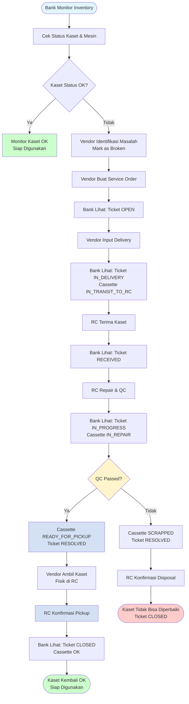

# 🏦 Panduan Pengguna Customer Bank - CASTER System

## 📋 Daftar Isi

1. [Pendahuluan](#pendahuluan)
2. [Akses Sistem](#akses-sistem)
3. [Dashboard](#dashboard)
4. [Monitoring Inventory](#monitoring-inventory)
5. [Monitoring Service Orders](#monitoring-service-orders)
6. [Laporan & Analytics](#laporan--analytics)
7. [Informasi Penting](#informasi-penting)
8. [FAQ](#faq)

---

## 1. Pendahuluan

### Tentang Sistem

**CASTER (Cassette Tracking & Retrieval System)** adalah sistem manajemen kaset ATM yang komprehensif untuk membantu bank mengelola dan memantau inventory kaset mereka. Sistem ini memberikan visibilitas real-time terhadap status kaset, service orders, dan perbaikan yang dilakukan oleh vendor dan Repair Center (RC).

### Peran Customer Bank

Customer Bank adalah bank yang menggunakan sistem untuk:
- **Monitoring** inventory kaset dan mesin ATM
- **Tracking** status kaset secara real-time
- **Melihat** service orders dan progress perbaikan
- **Mendapatkan** laporan dan analytics

### Akses Read-Only (VIEWER Role)

User Customer Bank memiliki akses **read-only (VIEWER)** yang berarti:
- ✅ **Dapat melihat** semua data terkait bank mereka
- ✅ **Dapat melihat** status kaset dan mesin
- ✅ **Dapat melihat** service orders dan history
- ✅ **Dapat export** laporan
- ❌ **Tidak dapat** membuat atau mengubah data
- ❌ **Tidak dapat** membuat service order
- ❌ **Tidak dapat** mengelola user

**Catatan:** Untuk membuat service order atau mengubah data, hubungi vendor (Pengelola) yang ditugaskan ke bank Anda.

---

## 2. Akses Sistem

### 2.1 Cara Login

1. Buka browser dan akses URL sistem (misalnya: `http://your-server:3000`)
2. Anda akan diarahkan ke halaman login
3. Masukkan **Username** dan **Password** yang diberikan oleh administrator
4. Klik tombol **Login**
5. Setelah login berhasil, Anda akan diarahkan ke Dashboard

**Catatan:**
- Pastikan Anda menggunakan kredensial yang benar
- Jika lupa password, hubungi administrator sistem
- Sistem menggunakan JWT authentication dengan session management

### 2.2 Dashboard Overview

Setelah login, Anda akan melihat Dashboard yang menampilkan:

- **Quick Stats Cards:**
  - Total Kaset (dari bank Anda)
  - Kondisi Baik (persentase kaset dengan status OK)
  - Dalam Perbaikan
  - Rusak

- **Analytics Section:**
  - Statistik kaset per status
  - Statistik mesin
  - Recent activities
  - Service order statistics

**Catatan:** Semua data yang ditampilkan hanya untuk bank Anda.

### 2.3 Navigasi Menu

Menu navigasi utama terletak di sidebar kiri:

- **Dashboard** (`/dashboard`) - Halaman utama dengan overview
- **Kaset** (`/cassettes`) - Daftar kaset bank
- **Mesin** (`/machines`) - Daftar mesin ATM bank
- **Service Orders** (`/tickets`) - Daftar service orders terkait bank
- **History** (`/history`) - Riwayat service orders yang sudah selesai

**Catatan:** Menu Settings tidak tersedia untuk Customer Bank karena akses read-only.

---

## 3. Monitoring Inventory

### 3.1 Melihat Mesin ATM Bank

1. Klik menu **Mesin** di sidebar
2. Halaman akan menampilkan daftar mesin ATM milik bank Anda
3. Anda dapat:
   - **Mencari mesin** menggunakan search bar (nomor serial, kode mesin, branch code)
   - **Filter berdasarkan status** (OPERATIONAL, UNDER_REPAIR, INACTIVE)
   - **Melihat detail mesin** dengan klik pada baris mesin
   - **Melihat identifier history** (perubahan WSID, serial number, dll)

**Informasi yang Ditampilkan:**
- Machine Code
- Serial Number Manufacturer
- Bank (hanya bank Anda)
- Status
- Lokasi (Branch Code, City, Address)
- Pengelola yang ditugaskan
- Jumlah kaset terpasang

**Status Mesin:**
- **OPERATIONAL** - Mesin beroperasi normal
- **UNDER_REPAIR** - Mesin sedang diperbaiki
- **INACTIVE** - Mesin tidak aktif

### 3.2 Melihat Kaset Bank

1. Klik menu **Kaset** di sidebar
2. Halaman akan menampilkan daftar kaset milik bank Anda

**Fitur Pencarian & Filter:**
- **Search Bar:** Cari berdasarkan nomor serial, tipe kaset, tipe mesin (VS/SR), atau status
- **Filter Status:** Klik pada status card untuk filter (OK, Rusak, Dalam Perjalanan, dll)
- **Sorting:** Klik header kolom untuk mengurutkan data

**Informasi yang Ditampilkan:**
- Nomor Serial
- Tipe Kaset (RB, AB, URJB)
- Tipe Mesin (VS, SR)
- Bank (hanya bank Anda)
- Status
- Jenis Penggunaan (Utama/Cadangan)
- Cycle Problem (jumlah service order)
- Replacement Info (jika kaset adalah replacement)
- Pengelola yang ditugaskan

**Status Kaset:**
- **OK** - Kaset dalam kondisi baik dan siap digunakan
- **Rusak (BAD)** - Kaset rusak dan perlu diperbaiki
- **Dalam Perjalanan ke RC (IN_TRANSIT_TO_RC)** - Kaset sedang dikirim ke Repair Center
- **Dalam Perbaikan (IN_REPAIR)** - Kaset sedang diperbaiki di RC
- **Siap Di-pickup (READY_FOR_PICKUP)** - Kaset sudah selesai diperbaiki dan siap diambil di RC oleh vendor
- **Tidak Layak Pakai (SCRAPPED)** - Kaset tidak bisa diperbaiki dan harus diganti

### 3.3 Status Kaset Real-Time

Sistem menampilkan status kaset secara real-time, sehingga Anda dapat:
- **Monitor** kondisi kaset kapan saja
- **Track** perpindahan kaset (dari mesin ke RC, dari RC kembali)
- **Lihat** progress perbaikan

**Cara Monitor:**
1. Buka halaman **Kaset**
2. Gunakan filter status untuk melihat kaset dengan status tertentu
3. Klik pada kaset untuk melihat detail lebih lanjut

---

## 4. Monitoring Service Orders

### 4.1 Melihat Ticket Terkait Bank

1. Klik menu **Service Orders** (`/tickets`)
2. Halaman menampilkan daftar service orders untuk kaset bank Anda
3. Tab yang tersedia:
   - **Repair** - Ticket untuk repair
   - **Replacement** - Ticket untuk replacement
   - **History** - Ticket yang sudah CLOSED

**Filter & Search:**
- **Search:** Cari berdasarkan ticket number, serial number, atau deskripsi
- **Filter Status:** OPEN, IN_DELIVERY, RECEIVED, IN_PROGRESS, RESOLVED, CLOSED
- **Filter Priority:** LOW, MEDIUM, HIGH, CRITICAL

**Informasi yang Ditampilkan:**
- Ticket Number (format: TKT-YYYYMMDD-XXXX)
- Cassette Serial Number(s)
- Status
- Priority
- Created Date
- Last Updated
- Pengelola yang membuat ticket

### 4.2 Status Repair

Untuk melihat detail repair:

1. Buka detail ticket (klik pada baris ticket)
2. Di halaman detail, Anda dapat melihat:
   - **Repair Status:** RECEIVED, DIAGNOSING, ON_PROGRESS, COMPLETED, SCRAPPED
   - **Repair Actions:** Tindakan perbaikan yang dilakukan
   - **Parts Replaced:** Parts yang diganti
   - **QC Result:** Hasil Quality Control (Passed/Failed)
   - **Repairer:** Engineer yang melakukan perbaikan

**Status Repair:**
- **RECEIVED** - Repair ticket dibuat, kaset diterima di RC
- **DIAGNOSING** - Sedang didiagnosis
- **ON_PROGRESS** - Sedang diperbaiki
- **COMPLETED** - Perbaikan selesai
- **SCRAPPED** - Kaset tidak bisa diperbaiki

### 4.3 Status Replacement

Untuk ticket replacement:

1. Buka detail ticket replacement
2. Anda dapat melihat:
   - **Old Cassette:** Serial number kaset lama (SCRAPPED)
   - **New Cassette:** Serial number kaset baru
   - **Status:** Progress replacement
   - **Pickup Info:** Informasi pickup dari RC

**Catatan:**
- Replacement hanya untuk kaset yang SCRAPPED
- Kaset baru akan memiliki status OK setelah diterima

### 4.4 History Ticket

1. Klik menu **History** (`/history`)
2. Halaman menampilkan semua ticket yang sudah **CLOSED** untuk bank Anda
3. Filter berdasarkan:
   - Date range
   - Priority
   - Search term

**Informasi yang Ditampilkan:**
- Ticket Number
- Cassette Serial Number(s)
- Status (CLOSED)
- Priority
- Created Date
- Closed Date
- Total Duration
- Final Status (OK atau SCRAPPED)

---

## 5. Laporan & Analytics

### 5.1 Statistik Kaset

Di halaman **Dashboard** atau **Kaset**, Anda dapat melihat:

- **Total Kaset:** Jumlah total kaset bank
- **Kondisi Baik:** Persentase kaset dengan status OK
- **Dalam Perbaikan:** Jumlah kaset sedang diperbaiki
- **Rusak:** Jumlah kaset rusak
- **Status Breakdown:** Distribusi kaset per status

**Cara Melihat:**
1. Buka **Dashboard** untuk overview
2. Atau buka **Kaset** untuk detail per status

### 5.2 Statistik Mesin

Di halaman **Dashboard** atau **Mesin**, Anda dapat melihat:

- **Total Mesin:** Jumlah total mesin ATM
- **Operational:** Jumlah mesin beroperasi
- **Under Repair:** Jumlah mesin sedang diperbaiki
- **Inactive:** Jumlah mesin tidak aktif

### 5.3 Export Laporan

**Export CSV:**
1. Di halaman **Kaset** atau **Service Orders**
2. Klik tombol **Export CSV**
3. File CSV akan terdownload dengan data yang sedang ditampilkan

**Format Export Kaset:**
- Serial Number
- Cassette Type
- Machine Type
- Bank
- Status
- Usage Type
- Cycle Problem (SO count)
- Repair Count
- Pengelola

**Format Export Service Orders:**
- Ticket Number
- Cassette Serial Number(s)
- Status
- Priority
- Created Date
- Closed Date
- Total Duration

### 5.4 Analytics Dashboard

Dashboard menampilkan berbagai analytics:

- **Health Score:** Skor kesehatan inventory (berdasarkan persentase kaset OK)
- **Top Issues:** Masalah yang paling sering terjadi
- **Recent Activities:** Aktivitas terbaru (ticket dibuat, kaset diperbaiki, dll)
- **Trend Analysis:** Trend jumlah kaset dan mesin over time

---

## 6. Informasi Penting

### 6.0 Diagram Alur Kerja (Dari Perspektif Bank)

Sebagai Customer Bank, berikut adalah alur kerja yang dapat Anda monitor:

**Catatan untuk Bank:**
- Semua aksi dilakukan oleh Vendor dan RC
- Bank hanya **monitor** status dan progress
- Status update otomatis oleh sistem
- Setelah repair selesai, kaset status menjadi **READY_FOR_PICKUP** dan siap diambil di RC
- Vendor mengambil kaset fisik di RC, kemudian RC mengonfirmasi pickup
- Setelah pickup dikonfirmasi, kaset langsung menjadi **OK** dan ticket menjadi **CLOSED**

### 6.1 Kontak Vendor yang Ditugaskan

Untuk melihat vendor (Pengelola) yang ditugaskan ke bank Anda:

1. Buka halaman **Mesin** atau **Kaset**
2. Di kolom **Pengelola**, Anda dapat melihat nama vendor yang ditugaskan
3. Atau hubungi administrator sistem untuk informasi kontak vendor

**Catatan:** Vendor yang ditugaskan bertanggung jawab untuk:
- Maintenance mesin ATM
- Membuat service order untuk kaset bermasalah
- Menerima kaset yang sudah diperbaiki

### 6.2 Kontak Repair Center

Repair Center (RC) adalah bagian dari Hitachi yang bertanggung jawab untuk:
- Menerima kaset yang dikirim dari vendor
- Memperbaiki kaset
- Melakukan Quality Control (QC)
- Mengirim kaset kembali ke vendor

**Untuk informasi kontak RC, hubungi:**
- Administrator sistem
- Atau vendor yang ditugaskan

### 6.3 Alur Kerja

**Flow Repair Kaset:**
1. Vendor mengidentifikasi kaset rusak
2. Vendor membuat service order
3. Vendor mengirim kaset ke RC
4. RC memperbaiki kaset
5. RC melakukan QC
6. Setelah QC passed, kaset status menjadi **READY_FOR_PICKUP**
7. Vendor mengambil kaset fisik di RC
8. RC Staff mengonfirmasi pickup di sistem (mewakili vendor)
9. Setelah pickup dikonfirmasi, kaset status menjadi **OK** dan ticket menjadi **CLOSED**

**Flow Replacement Kaset:**
1. Kaset gagal QC dan menjadi SCRAPPED
2. Vendor membuat replacement ticket
3. RC input serial number kaset baru (status OK)
4. Kaset baru status menjadi **READY_FOR_PICKUP**
5. Vendor mengambil kaset baru fisik di RC
6. RC Staff mengonfirmasi pickup di sistem
7. Setelah pickup dikonfirmasi, kaset baru status menjadi **OK** dan ticket menjadi **CLOSED**

---

## 7. FAQ

### 7.1 Pertanyaan Umum

#### Q: Apakah saya bisa membuat service order?
**A:** Tidak, sebagai Customer Bank dengan akses VIEWER, Anda hanya dapat melihat data. Untuk membuat service order, hubungi vendor (Pengelola) yang ditugaskan ke bank Anda.

#### Q: Bagaimana cara update status kaset?
**A:** Status kaset diupdate otomatis oleh sistem berdasarkan alur kerja. Vendor dan RC yang melakukan update status.

#### Q: Apakah saya bisa melihat kaset dari bank lain?
**A:** Tidak, Anda hanya dapat melihat kaset dari bank Anda sendiri.

#### Q: Bagaimana cara melihat detail repair?
**A:** Buka detail ticket, kemudian lihat bagian "Repair Details" untuk melihat informasi lengkap tentang perbaikan.

#### Q: Apakah saya bisa export semua data?
**A:** Ya, Anda dapat export data yang sedang ditampilkan di halaman menggunakan tombol "Export CSV".

#### Q: Bagaimana cara melihat history service order?
**A:** Klik menu **History** untuk melihat semua service order yang sudah CLOSED.

#### Q: Apakah saya bisa mengubah informasi kaset atau mesin?
**A:** Tidak, sebagai Customer Bank dengan akses VIEWER, Anda hanya dapat melihat data. Untuk perubahan, hubungi vendor atau administrator.

### 7.2 Masalah Teknis

#### Tidak Bisa Login
- **Penyebab:** Username/password salah atau user tidak aktif
- **Solusi:** 
  - Pastikan username dan password benar
  - Hubungi administrator jika masih tidak bisa login

#### Tidak Melihat Data
- **Penyebab:** User tidak memiliki akses ke bank tersebut
- **Solusi:** 
  - Pastikan user sudah di-assign ke bank yang benar
  - Hubungi administrator jika perlu

#### Data Tidak Update
- **Penyebab:** Cache browser atau data belum diupdate oleh vendor/RC
- **Solusi:** 
  - Refresh halaman (F5 atau Ctrl+R)
  - Clear browser cache jika perlu
  - Data akan update otomatis setelah vendor/RC melakukan aksi

### 7.3 Kontak Support

Jika mengalami masalah yang tidak bisa diselesaikan:
- Hubungi administrator sistem
- Atau hubungi vendor yang ditugaskan ke bank Anda
- Atau hubungi tim support Hitachi

---

## 8. Lampiran

### 8.1 Status Kaset Reference

| Status | Deskripsi | Arti untuk Bank |
|--------|-----------|-----------------|
| OK | Kaset dalam kondisi baik | Kaset siap digunakan |
| BAD | Kaset rusak | Kaset perlu diperbaiki |
| IN_TRANSIT_TO_RC | Sedang dikirim ke RC | Kaset dalam perjalanan ke RC |
| IN_REPAIR | Sedang diperbaiki | Kaset sedang diperbaiki di RC |
| READY_FOR_PICKUP | Siap diambil di RC | Kaset sudah selesai diperbaiki, vendor akan mengambil di RC |
| SCRAPPED | Tidak layak pakai | Kaset tidak bisa diperbaiki, perlu replacement |

### 8.2 Status Ticket Reference

| Status | Deskripsi | Arti untuk Bank |
|--------|-----------|-----------------|
| OPEN | Ticket baru dibuat | Vendor baru membuat ticket |
| IN_DELIVERY | Kaset sedang dikirim | Kaset dalam perjalanan ke RC |
| RECEIVED | RC menerima kaset | RC sudah menerima kaset |
| IN_PROGRESS | RC sedang memperbaiki | Kaset sedang diperbaiki |
| RESOLVED | Repair selesai, kaset READY_FOR_PICKUP | Kaset siap diambil di RC |
| CLOSED | Ticket selesai (pickup dikonfirmasi) | Ticket sudah selesai, kaset sudah diambil |

### 8.3 Status Repair Reference

| Status | Deskripsi | Arti untuk Bank |
|--------|-----------|-----------------|
| RECEIVED | Repair ticket dibuat | RC sudah menerima kaset untuk repair |
| DIAGNOSING | Sedang didiagnosis | RC sedang menganalisis masalah |
| ON_PROGRESS | Sedang diperbaiki | RC sedang melakukan perbaikan |
| COMPLETED | Perbaikan selesai | Perbaikan selesai, menunggu QC |
| SCRAPPED | Tidak bisa diperbaiki | Kaset tidak bisa diperbaiki |

### 8.4 Keyboard Shortcuts

- **/** - Fokus ke search bar (di halaman dengan search)
- **Escape** - Tutup dialog/modal

---

## 9. Best Practices

### 9.1 Monitoring Regular

- **Cek Dashboard** secara berkala untuk melihat overview kondisi kaset
- **Monitor Status Kaset** untuk memastikan tidak ada kaset yang stuck di status tertentu
- **Review History** untuk melihat pattern masalah yang terjadi

### 9.2 Export & Reporting

- **Export Data** secara berkala untuk backup dan analisis
- **Gunakan Filter** untuk mendapatkan data yang spesifik sebelum export
- **Simpan Export** untuk referensi dan audit

### 9.3 Komunikasi dengan Vendor

- **Koordinasi** dengan vendor untuk memastikan service order dibuat tepat waktu
- **Follow-up** jika ada ticket yang lama tidak ada progress
- **Verifikasi** setelah kaset diterima kembali

---

**Dokumen ini dibuat untuk membantu Customer Bank menggunakan sistem CASTER untuk monitoring dan tracking. Untuk pertanyaan lebih lanjut, hubungi administrator sistem atau vendor yang ditugaskan.**

