# 📘 Panduan Pengguna Pengelola - CASTER System

## 📋 Daftar Isi

1. [Pendahuluan](#pendahuluan)
2. [Akses Sistem](#akses-sistem)
3. [Dashboard](#dashboard)
4. [Manajemen Inventory](#manajemen-inventory)
5. [Service Order Management](#service-order-management)
6. [Alur Kerja Lengkap](#alur-kerja-lengkap)
7. [Laporan & History](#laporan--history)
8. [Settings & Konfigurasi](#settings--konfigurasi)
9. [Tips & Best Practices](#tips--best-practices)
10. [Troubleshooting](#troubleshooting)

---

## 1. Pendahuluan

### Tentang Sistem

**CASTER (Cassette Tracking & Retrieval System)** adalah sistem manajemen kaset ATM yang komprehensif untuk membantu vendor/service provider mengelola seluruh lifecycle kaset, dari inventory hingga maintenance. Sistem ini dirancang untuk meningkatkan efisiensi operasional, mengurangi downtime, dan memastikan kaset selalu dalam kondisi optimal.

### Peran Pengelola

Pengelola adalah vendor atau service provider yang bertanggung jawab untuk:
- Maintenance dan service mesin ATM di bank
- Mengelola inventory kaset yang ditugaskan
- Membuat service order untuk kaset yang bermasalah
- Menerima kaset yang sudah diperbaiki dari Repair Center (RC)

### Tipe User Pengelola

Sistem mendukung 3 tipe user Pengelola dengan level akses yang berbeda:

#### 1. ADMIN
- **Level:** Administrator Vendor
- **Akses:**
  - ✅ Mengelola user vendor (create, update, delete)
  - ✅ Melihat semua data vendor
  - ✅ Membuat service order
  - ✅ Mengelola delivery dan return
  - ✅ Mark kaset sebagai broken

---

## 2. Akses Sistem

### 2.1 Cara Login

1. Buka browser dan akses URL sistem (misalnya: `http://your-server:3000`)
2. Anda akan diarahkan ke halaman login
3. Masukkan **Username** dan **Password** yang diberikan oleh administrator
4. Klik tombol **Login**
5. Setelah login berhasil, Anda akan diarahkan ke Dashboard

**Catatan:**
- Pastikan Anda menggunakan kredensial yang benar
- Jika lupa password, hubungi administrator sistem
- Sistem menggunakan JWT authentication dengan session management

### 2.2 Dashboard Overview

Setelah login, Anda akan melihat Dashboard yang menampilkan:

- **Quick Stats Cards:**
  - Total Kaset
  - Kondisi Baik (persentase kaset dengan status OK)
  - Dalam Perbaikan
  - Rusak

- **Quick Actions:**
  - **Kelola Kaset** - Akses ke halaman manajemen kaset
  - **Buat SO** - Membuat Service Order baru

- **Analytics Section:**
  - Statistik kaset per status
  - Statistik mesin
  - Recent activities
  - Ticket statistics

### 2.3 Navigasi Menu

Menu navigasi utama terletak di sidebar kiri:

- **Dashboard** (`/dashboard`) - Halaman utama dengan overview
- **Kaset** (`/cassettes`) - Manajemen inventory kaset
- **Mesin** (`/machines`) - Daftar mesin ATM
- **Service Orders** (`/tickets`) - Manajemen service order
- **History** (`/history`) - Riwayat service order yang sudah selesai
- **Settings** (`/settings`) - Pengaturan (untuk ADMIN)

---

## 3. Manajemen Inventory

### 3.1 Melihat Mesin ATM

1. Klik menu **Mesin** di sidebar
2. Halaman akan menampilkan daftar mesin ATM yang ditugaskan ke vendor Anda
3. Anda dapat:
   - **Mencari mesin** menggunakan search bar (nomor serial, kode mesin, branch code)
   - **Filter berdasarkan status** (OPERATIONAL, UNDER_REPAIR, INACTIVE)
   - **Filter berdasarkan bank**
   - **Melihat detail mesin** dengan klik pada baris mesin
   - **Melihat identifier history** (perubahan WSID, serial number, dll)

**Informasi yang Ditampilkan:**
- Machine Code
- Serial Number Manufacturer
- Bank
- Status
- Lokasi (Branch Code, City, Address)
- Pengelola yang ditugaskan
- Jumlah kaset terpasang

### 3.2 Melihat Kaset

1. Klik menu **Kaset** di sidebar
2. Halaman akan menampilkan daftar kaset dari bank yang ditugaskan ke vendor Anda

**Fitur Pencarian & Filter:**
- **Search Bar:** Cari berdasarkan nomor serial, tipe kaset, tipe mesin (VS/SR), bank, atau status
- **Filter Status:** Klik pada status card untuk filter (OK, Rusak, Dalam Perjalanan, dll)
- **Filter Bank:** Pilih bank tertentu (jika Anda mengelola multiple banks)
- **Sorting:** Klik header kolom untuk mengurutkan data

**Informasi yang Ditampilkan:**
- Nomor Serial
- Tipe Kaset (RB, AB, URJB)
- Tipe Mesin (VS, SR)
- Bank
- Status
- Jenis Penggunaan (Utama/Cadangan)
- Cycle Problem (jumlah service order)
- Replacement Info (jika kaset adalah replacement)
- Pengelola

**Status Kaset:**
- **OK** - Kaset dalam kondisi baik dan siap digunakan
- **Rusak (BAD)** - Kaset rusak dan perlu diperbaiki
- **Dikirim ke RC (IN_TRANSIT_TO_RC)** - Kaset sedang dikirim ke Repair Center
- **Dalam Perbaikan (IN_REPAIR)** - Kaset sedang diperbaiki di RC
- **Siap Di-pickup (READY_FOR_PICKUP)** - Kaset sudah selesai diperbaiki dan siap diambil di RC
- **Tidak Layak Pakai (SCRAPPED)** - Kaset tidak bisa diperbaiki dan harus diganti

### 3.3 Mark Kaset sebagai Broken

Fitur ini memungkinkan Anda untuk menandai kaset dengan status **OK** sebagai **rusak (BAD)**.

**Cara Menggunakan:**
1. Buka halaman **Kaset** (`/cassettes`)
2. Cari kaset dengan status **OK** yang ingin ditandai sebagai rusak
3. Di kolom **Quick Actions**, klik tombol **Tandai Rusak**
4. Dialog akan muncul, isi **Alasan Kaset Rusak** (wajib diisi)
   - Contoh: "Sensor error - cassette not accepting bills"
   - Contoh: "Jammed mechanism"
5. Klik **Tandai sebagai Rusak**
6. Sistem akan mengupdate status kaset menjadi **BAD**

**Catatan Penting:**
- ⚠️ Hanya kaset dengan status **OK** yang bisa ditandai sebagai rusak
- ⚠️ Alasan harus diisi (minimal 10 karakter)
- ⚠️ Setelah ditandai sebagai rusak, kaset dapat dibuatkan Service Order untuk repair
- ⚠️ Tindakan ini tidak dapat dibatalkan, pastikan alasan sudah benar

**Kapan Menggunakan:**
- Ketika kaset di lapangan mengalami masalah dan perlu diperbaiki
- Sebelum membuat Service Order untuk repair
- Untuk tracking kondisi kaset secara real-time

---

## 4. Service Order Management

### 4.1 Membuat Service Order (Ticket)

Service Order adalah tiket untuk melaporkan masalah kaset yang perlu diperbaiki atau diganti.

#### 4.1.1 Single Cassette Ticket

**Langkah-langkah:**
1. Klik menu **Service Orders** → **Create** atau klik **Buat SO** di Dashboard
2. Pilih tipe ticket:
   - **Repair** - Untuk kaset yang perlu diperbaiki
   - **Replacement** - Untuk kaset SCRAPPED yang perlu diganti
3. Isi form ticket:
   - **Machine** (opsional) - Pilih mesin ATM yang terkena
   - **Cassette Serial Number** - Input atau scan serial number kaset
   - **Title** - Judul masalah (wajib)
   - **Description** - Deskripsi detail masalah (wajib)
   - **Priority** - Pilih prioritas (LOW, MEDIUM, HIGH, CRITICAL)
   - **Delivery Method** - Pilih metode pengiriman (Courier, Direct Delivery)
   - **Courier Info** (jika pakai kurir):
     - Courier Service (JNE, TIKI, Pos Indonesia, dll)
     - Tracking Number
     - Estimated Arrival Date
4. Klik **Submit** untuk membuat ticket

**Status Ticket:** `OPEN` → `IN_DELIVERY` (jika delivery info diisi langsung)

#### 4.1.2 Multi-Cassette Ticket

Untuk ticket dengan multiple kaset (maksimal 30 kaset):

1. Ikuti langkah 1-3 di atas
2. Di form, Anda dapat menambahkan multiple cassettes:
   - Klik **Add Cassette**
   - Input serial number untuk setiap kaset
   - Isi detail masalah per kaset
3. Submit ticket

**Catatan:**
- Multi-cassette ticket berguna untuk batch repair
- Setiap kaset dalam ticket akan memiliki repair ticket terpisah di RC

### 4.2 Melihat Status Ticket

1. Klik menu **Service Orders** (`/tickets`)
2. Halaman menampilkan daftar ticket dengan tab:
   - **Repair** - Ticket untuk repair
   - **Replacement** - Ticket untuk replacement
   - **History** - Ticket yang sudah CLOSED

**Filter & Search:**
- **Search:** Cari berdasarkan ticket number, serial number, atau deskripsi
- **Filter Status:** OPEN, IN_DELIVERY, RECEIVED, IN_PROGRESS, RESOLVED, CLOSED
- **Filter Priority:** LOW, MEDIUM, HIGH, CRITICAL

**Informasi yang Ditampilkan:**
- Ticket Number (format: SO-YYYYMMDD-XXXX)
- Cassette Serial Number(s)
- Status
- Priority
- Created Date
- Last Updated

### 4.3 Membuat Form Pengiriman

Setelah ticket dibuat, Anda perlu membuat form pengiriman untuk mengirim kaset ke RC:

1. Buka detail ticket (klik pada baris ticket)
2. Klik tombol **Create Delivery** atau navigasi ke `/tickets/[id]/delivery`
3. Isi form pengiriman:
   - **Cassettes to Ship** - Pilih kaset yang akan dikirim (jika multi-cassette)
   - **Shipping Date** - Tanggal pengiriman
   - **Courier Service** - Jasa kurir (JNE, TIKI, Pos Indonesia, dll)
   - **Tracking Number** - Nomor resi/tracking
   - **Estimated Arrival** - Estimasi tiba di RC
   - **Sender Address** (opsional) - Jika berbeda dari alamat kantor
   - **Notes** (opsional) - Catatan tambahan
4. Klik **Submit**

**Status Ticket:** `OPEN` → `IN_DELIVERY`
**Status Cassette:** `OK` atau `BAD` → `IN_TRANSIT_TO_RC`

**Catatan:**
- Setelah delivery dibuat, kaset akan otomatis dihapus dari mesin (machineId = null)
- Pastikan tracking number sudah benar untuk monitoring pengiriman

### 4.4 Pickup Kaset dari RC

**Catatan Penting:** Flow pickup dilakukan oleh RC Staff yang mengonfirmasi pickup atas nama Pengelola. Pengelola tidak perlu melakukan aksi di sistem untuk pickup.

**Flow Pickup:**
1. Setelah repair selesai dan QC passed, kaset status menjadi **READY_FOR_PICKUP**
2. Kaset fisik siap diambil di RC
3. Pengelola mengirim perwakilan untuk mengambil kaset di RC
4. **RC Staff** mengonfirmasi pickup di sistem dengan mengisi:
   - Nama pengambil (perwakilan Pengelola)
   - Nomor HP pengambil
   - Tanda tangan digital
   - Catatan (opsional)
5. Setelah RC Staff konfirmasi pickup:
   - **Status Cassette:** `READY_FOR_PICKUP` → `OK`
   - **Status Ticket:** `RESOLVED` → `CLOSED`
   - Kaset siap digunakan kembali

**Catatan:**
- Pickup confirmation dilakukan oleh RC Staff (bukan Pengelola)
- Pengelola hanya perlu mengirim perwakilan untuk mengambil kaset fisik
- Setelah pickup dikonfirmasi, kaset langsung menjadi OK dan ticket menjadi CLOSED
- Tidak ada langkah "receive return" oleh Pengelola

### 4.5 Menutup Ticket

**Catatan:** Ticket akan otomatis tertutup setelah:
- RC Staff mengonfirmasi pickup (untuk kaset READY_FOR_PICKUP)
- Atau jika kaset gagal QC dan menjadi SCRAPPED (disposal confirmation)

---

## 5. Alur Kerja Lengkap

### 5.1 Flow Repair Kaset

```mermaid
flowchart TD
    Start([Identifikasi Kaset Rusak]) --> MarkBroken[Mark Kaset sebagai Broken<br/>Status: OK → BAD]
    MarkBroken --> CreateTicket[Buat Service Order<br/>Tipe: Repair]
    CreateTicket --> TicketOpen[Ticket Status: OPEN]
    TicketOpen --> CreateDelivery[Input Form Pengiriman]
    CreateDelivery --> TicketDelivery[Ticket Status: IN_DELIVERY<br/>Cassette Status: IN_TRANSIT_TO_RC]
    TicketDelivery --> PhysicalShip[Kirim Kaset Fisik ke RC]
    PhysicalShip --> RCReceive[RC Terima Kaset<br/>Ticket Status: RECEIVED]
    RCReceive --> RCRepair[RC Repair & QC<br/>Cassette Status: IN_REPAIR]
    RCRepair --> QCCheck{QC Passed?}
    QCCheck -->|Ya| ReadyPickup[Cassette Status: READY_FOR_PICKUP<br/>Ticket Status: RESOLVED]
    QCCheck -->|Tidak| Scrapped[Cassette Status: SCRAPPED<br/>Ticket Status: RESOLVED]
    ReadyPickup --> PhysicalPickup[Pengelola Ambil Kaset<br/>Fisik di RC]
    PhysicalPickup --> RCPickupConfirm[RC Staff Konfirmasi Pickup<br/>Input: Nama & HP Pengambil, Signature]
    RCPickupConfirm --> TicketClosed[Cassette Status: OK<br/>Ticket Status: CLOSED]
    TicketClosed --> End([Selesai - Kaset Siap Digunakan])
    Scrapped --> RCDisposalConfirm[RC Staff Konfirmasi Disposal<br/>Kaset Tetap di RC]
    RCDisposalConfirm --> EndScrap([Selesai - Kaset Tidak Bisa Diperbaiki<br/>Ticket Status: CLOSED])
    
    style Start fill:#e1f5ff
    style End fill:#ccffcc
    style EndScrap fill:#ffcccc
    style QCCheck fill:#fff4cc
    style ReadyPickup fill:#d4e1f5
    style RCPickupConfirm fill:#d4e1f5
```

**Step-by-Step:**

1. **Identifikasi Masalah**
   - Supervisor/Staff menemukan kaset rusak di lapangan
   - Mark kaset sebagai broken (jika status masih OK)

2. **Buat Service Order**
   - Login ke sistem
   - Buat ticket tipe Repair
   - Isi detail masalah dan priority

3. **Input Form Pengiriman**
   - Buat delivery form
   - Isi informasi kurir dan tracking number
   - Kirim kaset fisik ke RC

4. **Monitoring di RC**
   - RC menerima kaset
   - RC membuat repair ticket
   - RC melakukan perbaikan dan QC
   - Setelah QC passed, status menjadi **READY_FOR_PICKUP**

5. **Pickup dari RC**
   - Kaset status **READY_FOR_PICKUP** berarti siap diambil di RC
   - Pengelola mengirim perwakilan untuk mengambil kaset fisik di RC
   - **RC Staff** mengonfirmasi pickup di sistem (mewakili Pengelola)
   - Setelah pickup dikonfirmasi, status menjadi **OK** dan ticket menjadi **CLOSED**

### 5.2 Flow Replacement Kaset

**Step-by-Step:**

1. **Kaset SCRAPPED**
   - Kaset yang gagal QC di RC menjadi SCRAPPED
   - Kaset lama tidak bisa diperbaiki

2. **Buat Replacement Ticket**
   - Buat ticket tipe Replacement
   - RC akan input serial number kaset baru (status OK)

3. **Pickup Kaset Baru**
   - Kaset baru status menjadi **READY_FOR_PICKUP**
   - Pengelola mengirim perwakilan untuk mengambil kaset baru di RC
   - **RC Staff** mengonfirmasi pickup di sistem
   - Setelah pickup dikonfirmasi, kaset baru status menjadi **OK** dan ticket menjadi **CLOSED**

**Catatan:**
- Hanya kaset dengan status SCRAPPED yang bisa diganti
- Kaset baru langsung status OK setelah RC input SN
- Pickup dilakukan dari RC (tidak ada pengiriman)
- Tidak ada langkah "receive return" oleh Pengelola

### 5.3 Status Tracking

**Status Cassette:**
- `OK` → `BAD` (Mark as Broken)
- `BAD` → `IN_TRANSIT_TO_RC` (Create Delivery)
- `IN_TRANSIT_TO_RC` → `IN_REPAIR` (RC Create Repair Ticket)
- `IN_REPAIR` → `READY_FOR_PICKUP` (QC Passed) atau `SCRAPPED` (QC Failed)
- `READY_FOR_PICKUP` → `OK` (RC Confirm Pickup)

**Status Ticket:**
- `OPEN` → `IN_DELIVERY` (Create Delivery)
- `IN_DELIVERY` → `RECEIVED` (RC Receive)
- `RECEIVED` → `IN_PROGRESS` (RC Create Repair Ticket)
- `IN_PROGRESS` → `RESOLVED` (Repair Completed - QC Passed atau Failed)
- `RESOLVED` → `CLOSED` (RC Confirm Pickup atau Disposal)

**Catatan Penting:**
- Setelah repair selesai dan QC passed, kaset status menjadi **READY_FOR_PICKUP**
- Pengelola mengambil kaset fisik di RC
- **RC Staff** mengonfirmasi pickup di sistem (mewakili Pengelola)
- Setelah pickup dikonfirmasi, kaset langsung menjadi **OK** dan ticket menjadi **CLOSED**
- Tidak ada status **IN_TRANSIT_TO_PENGELOLA** untuk flow repair normal

---

## 6. Laporan & History

### 6.1 Melihat History Ticket

1. Klik menu **History** (`/history`)
2. Halaman menampilkan semua ticket yang sudah **CLOSED**
3. Filter berdasarkan:
   - Date range
   - Status (hanya CLOSED)
   - Priority
   - Search term

**Informasi yang Ditampilkan:**
- Ticket Number
- Cassette Serial Number(s)
- Status (CLOSED)
- Priority
- Created Date
- Closed Date
- Total Duration

### 6.2 Export Data

**Export CSV:**
1. Di halaman **Kaset** atau **Service Orders**
2. Klik tombol **Export CSV**
3. File CSV akan terdownload dengan data yang sedang ditampilkan

**Format Export:**
- Serial Number
- Cassette Type
- Machine Type
- Bank
- Status
- Usage Type
- Cycle Problem (SO count)
- Repair Count
- Pengelola

---

## 7. Settings & Konfigurasi

### 7.1 Profile Management

1. Klik menu **Settings** (`/settings`)
2. Tab **Profile** menampilkan:
   - Username
   - Email
   - Full Name
   - Phone
   - Role
   - Status

**Catatan:** Update profile harus dilakukan oleh administrator.

### 7.2 User Management (ADMIN Only)

Hanya user dengan role **ADMIN** yang bisa mengelola user vendor:

1. Klik menu **Settings** → Tab **Users**
2. Anda dapat:
   - **Membuat User Baru:**
     - Klik **Add User**
     - Isi form: Username, Email, Full Name, Phone, Role, Password
     - Set permission flags (canCreateTickets, canCloseTickets, canManageMachines)
     - Set assigned branches (opsional, untuk membatasi akses ke branch tertentu)
   - **Update User:**
     - Klik pada user yang ingin diupdate
     - Edit informasi
     - Save changes
   - **Delete User:**
     - Klik tombol delete
     - Konfirmasi penghapusan

**Permission Flags:**
- `canCreateTickets` - Bisa membuat service order (default: true)
- `canCloseTickets` - Bisa menutup ticket (default: false)
- `canManageMachines` - Bisa manage machines (default: false)

**Assigned Branches:**
- Bisa di-assign ke branch tertentu untuk membatasi akses
- Jika null, user bisa akses semua branches vendor

---

## 8. Tips & Best Practices

### 8.1 Cara Menggunakan Sistem dengan Efisien

1. **Gunakan Search & Filter**
   - Manfaatkan search bar untuk mencari kaset atau ticket dengan cepat
   - Gunakan filter status untuk fokus pada kaset yang perlu perhatian

2. **Mark as Broken Sebelum Create Ticket**
   - Selalu mark kaset sebagai broken sebelum membuat service order
   - Ini memastikan status kaset akurat di sistem

3. **Input Delivery Info Lengkap**
   - Selalu isi tracking number saat membuat delivery
   - Ini membantu monitoring pengiriman

4. **Monitor Status Regularly**
   - Cek status ticket secara berkala
   - Update delivery info jika ada perubahan

5. **Gunakan Multi-Cassette Ticket untuk Batch**
   - Jika ada multiple kaset yang perlu repair, gunakan multi-cassette ticket
   - Lebih efisien daripada membuat multiple single-cassette tickets

### 8.2 Best Practices

1. **Documentation**
   - Selalu isi description dengan detail saat membuat ticket
   - Ini membantu RC memahami masalah dengan lebih baik

2. **Priority Setting**
   - Gunakan priority yang sesuai:
     - **CRITICAL** - Kaset menyebabkan mesin down
     - **HIGH** - Masalah serius yang perlu segera ditangani
     - **MEDIUM** - Masalah normal
     - **LOW** - Masalah minor

3. **Tracking Number**
   - Selalu input tracking number yang valid
   - Update jika ada perubahan

4. **Monitor READY_FOR_PICKUP Status**
   - Cek secara berkala kaset dengan status READY_FOR_PICKUP
   - Segera ambil kaset fisik di RC setelah status READY_FOR_PICKUP
   - RC akan mengonfirmasi pickup setelah kaset diambil

---

## 9. Troubleshooting

### 9.1 Masalah Umum

#### Tidak Bisa Login
- **Penyebab:** Username/password salah atau user tidak aktif
- **Solusi:** 
  - Pastikan username dan password benar
  - Hubungi administrator jika masih tidak bisa login

#### Tidak Bisa Melihat Kaset/Mesin
- **Penyebab:** User tidak memiliki akses ke bank/mesin tersebut
- **Solusi:** 
  - Pastikan bank/mesin sudah di-assign ke vendor Anda
  - Hubungi administrator jika perlu

#### Tidak Bisa Mark as Broken
- **Penyebab:** Kaset tidak dalam status OK
- **Solusi:** 
  - Hanya kaset dengan status OK yang bisa ditandai sebagai broken
  - Jika kaset sudah BAD, langsung buat service order

#### Tidak Bisa Create Ticket
- **Penyebab:** Permission `canCreateTickets = false`
- **Solusi:** 
  - Hubungi ADMIN vendor untuk update permission
  - Atau minta ADMIN yang membuat ticket

#### Ticket Tidak Bisa Ditutup
- **Penyebab:** Permission `canCloseTickets = false` atau ticket belum RESOLVED
- **Solusi:** 
  - Ticket akan otomatis tertutup setelah RC mengonfirmasi pickup
  - Atau hubungi ADMIN untuk menutup ticket

### 9.2 Error Messages

#### "Only OK cassettes can be marked as broken"
- **Penyebab:** Mencoba mark kaset yang tidak dalam status OK
- **Solusi:** Pastikan kaset dalam status OK sebelum mark as broken

#### "Cassette not found"
- **Penyebab:** Serial number tidak ada di sistem
- **Solusi:** Pastikan serial number benar dan kaset sudah terdaftar

#### "Invalid credentials"
- **Penyebab:** Username/password salah
- **Solusi:** Periksa kembali kredensial login

### 9.3 Kontak Support

Jika mengalami masalah yang tidak bisa diselesaikan:
- Hubungi administrator sistem
- Atau hubungi tim support Hitachi

---

## 10. Lampiran

### 10.1 Keyboard Shortcuts

- **/** - Fokus ke search bar (di halaman dengan search)
- **Escape** - Tutup dialog/modal

### 10.2 Status Kaset Reference

| Status | Deskripsi | Dapat Dilakukan |
|--------|-----------|-----------------|
| OK | Kaset dalam kondisi baik | Mark as Broken, Create Ticket |
| BAD | Kaset rusak | Create Ticket (Repair) |
| IN_TRANSIT_TO_RC | Sedang dikirim ke RC | Monitor tracking |
| IN_REPAIR | Sedang diperbaiki di RC | Monitor progress |
| READY_FOR_PICKUP | Siap diambil di RC | Ambil kaset fisik di RC, RC akan konfirmasi pickup |
| SCRAPPED | Tidak layak pakai | Create Ticket (Replacement) |

### 10.3 Status Ticket Reference

| Status | Deskripsi | Aksi yang Bisa Dilakukan |
|--------|-----------|--------------------------|
| OPEN | Ticket baru dibuat | Create Delivery |
| IN_DELIVERY | Kaset sedang dikirim | Monitor tracking |
| RECEIVED | RC menerima kaset | Menunggu RC repair |
| IN_PROGRESS | RC sedang memperbaiki | Monitor progress |
| RESOLVED | Repair selesai, kaset READY_FOR_PICKUP | Ambil kaset fisik di RC |
| CLOSED | Ticket selesai (pickup dikonfirmasi) | View history |

---

**Dokumen ini dibuat untuk membantu Pengelola menggunakan sistem CASTER dengan efektif. Untuk pertanyaan lebih lanjut, hubungi administrator sistem.**

